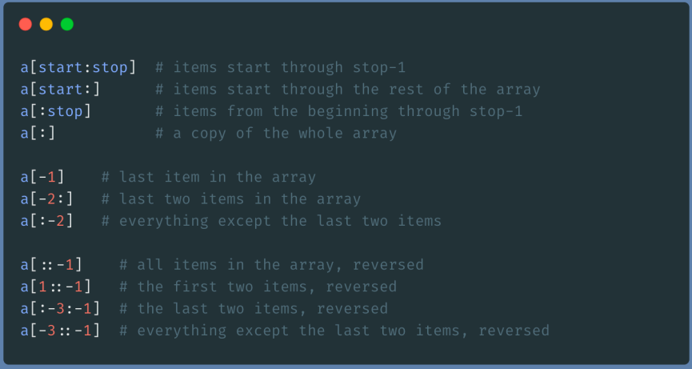

# Python formation

https://notepad.re/pythonperf
https://docadmin.orsys.fr/Emargement/Participant

## Todo

- use mypy
- https://fr.wikipedia.org/wiki/Zen_de_Python
- Programmation Orientée Aspect (POA), Spring, https://en.wikipedia.org/wiki/Aspect-oriented_programming
- pydantic:
    - https://threeofwands.com/why-i-use-attrs-instead-of-pydantic/
- Flask, ratelimiter, timeit
- utiliser les variables privées
- https://www.attrs.org/en/stable/examples.html
- `@override`
- sqlite3
- https://www.fullstackpython.com/object-relational-mappers-orms.html
- https://agiledata.org/essays/impedanceMismatch.html
- https://docs.python.org/fr/3/library/tkinter.html
- https://python-poetry.org/
- https://docs.scrapy.org/en/latest/intro/tutorial.html
- https://www.python-httpx.org/
- https://docs.aiohttp.org/en/stable/
- https://realpython.com/async-io-python/

## Notes

### Slices

### Exception

D'une manière globale, les librairies ne devraient pas gérer les exceptions, juste les renvoyer.
Au main de gérer les exceptions et de les traiter.
Les librairies utiliseront `finally`.

### Multiprocessing

Plutôt pour le calcul. Pour les I/O, on fera plutôt du multithreading.
